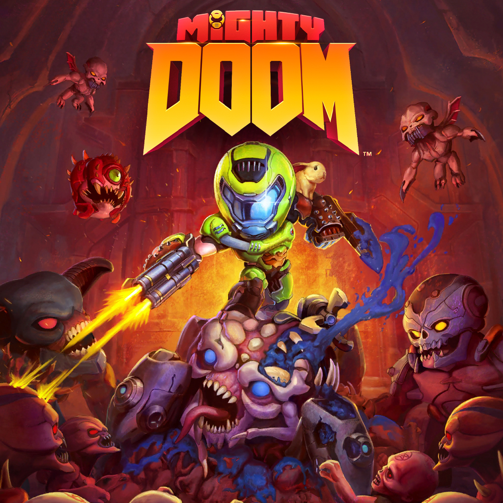

# MightyDoom
A demake (remake for an older platform) of Mighty Doom for the Nintendo 64.

# Current New Feature TODO List
- [ ] Add Enemy Damage Numbers
- [X] Add Slayer Drop in Animation
- [ ] Add Spinning Banner Under Enemies
- [X] Add Fight Audio
- [ ] Add the Hunt Beings Audio

# Current Bug TODO List
- [x] Fix Zombie Memory Leak (attack animation and skeleblend)
- [X] Fix Leak when switching back and forth between menu
- [X] Normalize Slayer Speed